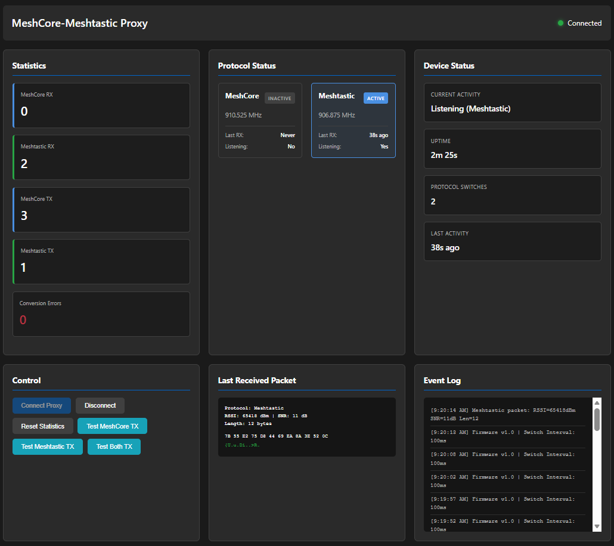

# MeshCore-Meshtastic Proxy

A bidirectional proxy device that bridges MeshCore and Meshtastic mesh networks, allowing nodes from both protocols to communicate with each other.

## Supported Devices

The proxy supports multiple hardware platforms through its modular architecture. Each platform has its own implementation in `src/platforms/`.

### LoRa32u4II (ATmega32u4 + SX1276)

**Specifications:**
- **MCU**: ATmega32u4 @ 8MHz
- **Radio**: SX1276 LoRa module
- **Max TX Power**: 17 dBm (hardware limit)
- **SPI Speed**: 1 MHz
- **Serial**: 115200 baud
- **Vendor**: [BSFrance](https://bsfrance.fr/lora-long-range/1345-LoRa32u4-II-Lora-LiPo-Atmega32u4-SX1276-HPD13-868MHZ-EU-Antenna.html)

**Pin Connections:**
- **SPI Interface**:
  - NSS (CS): Pin 8
  - MOSI: Pin 16
  - MISO: Pin 14
  - SCK: Pin 15
- **SX1276 Control Pins**:
  - RST: Pin 4
  - DIO0: Pin 7
  - DIO1: Pin 5 (must be manually wired for board versions < 1.3)
- **LED**: Pin 13 (built-in LED)

**Important Notes:**
- For board versions **before 1.3**, DIO1 must be manually wired from the SX1276 module to GPIO pin 5. Check the label on your PCB - version 1.3 has DIO1 already wired on the PCB.
- Upload requires manual bootloader activation (double-press RESET button) - see [Upload Process](#building-and-uploading) section.

**Build Environment:** `env:lora32u4II`

### RAK4631 (nRF52840 + SX1262)

**Specifications:**
- **MCU**: nRF52840 (ARM Cortex-M4)
- **Radio**: SX1262 LoRa module
- **Max TX Power**: 22 dBm
- **SPI Speed**: 8 MHz
- **Serial**: 115200 baud
- **Vendor**: [RAK Wireless](https://store.rakwireless.com/products/rak4631-lpwan-node)

**Features:**
- Higher performance MCU with more RAM and flash
- SX1262 radio with improved sensitivity
- Higher maximum TX power (22 dBm vs 17 dBm)
- Native USB support

**Build Environment:** `env:rak4631`

### Adding Support for New Devices

To add support for a new device, see the [Architecture](#architecture) section for details on implementing a new platform layer.

## Frequency Configuration

The device defaults to **853MHz**, but this proxy configures it to **910.525 MHz** to match MeshCore's default frequency. Meshtastic uses **906.875 MHz**.

- **MeshCore Frequency**: 910.525 MHz
- **Meshtastic Frequency**: 906.875 MHz

**Note for Spectrum Analyzer Users**: When testing transmissions, look specifically at these frequencies:
- MeshCore test messages: **910.525 MHz**
- Meshtastic test messages: **906.875 MHz**

These are in the 900 MHz ISM band (902-928 MHz in the US). The device switches between these frequencies during operation, so you may see activity on both frequencies.

## Protocol Details

### MeshCore Standard Channel ("Public")

MeshCore uses a standard "Public" channel configuration (USA/Canada Recommended Preset) with the following parameters:
- **Frequency**: 910.525 MHz
- **Bandwidth**: 62.5 kHz
- **Spreading Factor**: 7
- **Coding Rate**: 5
- **Sync Word**: 0x12
- **Preamble**: 8 bytes

This proxy is configured to match MeshCore's standard "Public" channel settings for maximum compatibility.



*MeshCore configuration interface showing the standard "Public" channel settings (USA/Canada Recommended Preset)*

### MeshCore Packet Format

Wire format (as defined in `Packet.cpp`):
```
- Header byte (bits: route_type[0:1], payload_type[2:5], version[6:7])
- Optional: 4 bytes transport codes (if route type has transport)
  - transport_codes[0] (2 bytes, little-endian)
  - transport_codes[1] (2 bytes, little-endian)
- Path length byte (path_len)
- Path data (variable, max 64 bytes)
- Payload data (variable, max 184 bytes)
```

**LoRa Parameters** (USA/Canada Recommended Preset - "Public" channel):
- Spreading Factor: 7
- Bandwidth: 62.5 kHz (MeshCore standard)
- Coding Rate: 5
- Sync Word: 0x12
- Preamble: 8 bytes
- Transmit Power: 17 dBm (hardware limit for LoRa32u4-II; MeshCore may use up to 22 dBm)

### Meshtastic Packet Format

Wire format (as defined in `RadioInterface.cpp`):
```
- PacketHeader (16 bytes):
  - to (NodeNum, 4 bytes, little-endian)
  - from (NodeNum, 4 bytes, little-endian)
  - id (PacketId, 4 bytes, little-endian)
  - flags (1 byte: hop_limit[0:2], want_ack[3], via_mqtt[4], hop_start[5:7])
  - channel (1 byte: channel hash)
  - next_hop (1 byte: last byte of NodeNum)
  - relay_node (1 byte: last byte of NodeNum)
- Payload: encrypted.bytes (protobuf encoded, max 237 bytes)
```

**LoRa Parameters**:
- Spreading Factor: 7
- Bandwidth: 250 kHz (Meshtastic standard)
- Coding Rate: 5
- Sync Word: 0x2B
- Preamble: 16 bytes

## How It Works

The proxy operates as a **bidirectional relay** that listens continuously on one protocol and retransmits received packets to other configured protocols:

1. **Continuous Reception**: Listens continuously on a single configured protocol (default: MeshCore)
   - The radio is configured for the listening protocol's frequency and LoRa parameters
   - Uses sync word filtering to detect packets from the listening protocol
   - No time-slicing - the device listens exclusively to one protocol at a time
2. **Packet Reception**: When a packet is received on the listening protocol:
   - Packet is validated (RSSI, length, CRC)
   - Packet is parsed according to the listening protocol's format
3. **MQTT Filtering**: Meshtastic packets with `via_mqtt` flag set are filtered out before conversion - only radio-originated Meshtastic packets are forwarded to MeshCore (MeshCore is a pure radio mesh network)
4. **Protocol Conversion**: Converts packet format from the listening protocol to canonical format, then to target protocol formats
5. **Retransmission**: Immediately retransmits converted packets to all configured transmit protocols with their appropriate LoRa parameters
   - Each retransmission switches the radio to the target protocol's frequency and parameters
   - After transmission, the radio returns to listening mode on the configured RX protocol
6. **Test Messages**: Automatically sends test messages on all transmit protocols at startup, and can be triggered manually via the web interface

**Note**: The proxy listens on **one protocol at a time**. To bridge both directions, you would need two proxy devices (one listening on MeshCore, one listening on Meshtastic), or use the web interface to switch the listening protocol as needed.

### Conversion Process

**MeshCore → Meshtastic**:
- Extracts payload from MeshCore packet
- Creates Meshtastic header with broadcast destination (0xFFFFFFFF)
- Wraps MeshCore payload as Meshtastic encrypted payload
- Retransmits with Meshtastic LoRa parameters

**Meshtastic → MeshCore**:
- Parses Meshtastic 16-byte header
- **Filters out MQTT-originated packets**: Packets with `via_mqtt` flag set are dropped and not forwarded to MeshCore (MeshCore is a pure radio mesh network)
- Extracts protobuf payload from radio-originated packets only
- Creates MeshCore packet with FLOOD route type
- Uses RAW_CUSTOM payload type to preserve protobuf data
- Retransmits with MeshCore LoRa parameters

## Architecture

The proxy is built with a modular three-layer architecture that separates platform-specific hardware, radio hardware abstraction, and protocol handling. This design enables support for multiple hardware platforms and radio chips while maintaining a clean, extensible codebase.

### Layer Overview

```
┌─────────────────────────────────────────────────────────────┐
│                    Application Layer                        │
│  (main.cpp, protocol_manager, canonical_packet)            │
└─────────────────────────────────────────────────────────────┘
                            │
                            ▼
┌─────────────────────────────────────────────────────────────┐
│                    Protocol Layer                            │
│  ┌──────────────┐  ┌──────────────┐                        │
│  │  MeshCore    │  │  Meshtastic  │                        │
│  │  Protocol    │  │  Protocol    │                        │
│  └──────────────┘  └──────────────┘                        │
│         │                  │                                │
│         └──────────┬───────┘                                │
│                    ▼                                        │
│         Canonical Packet Format                             │
└─────────────────────────────────────────────────────────────┘
                            │
                            ▼
┌─────────────────────────────────────────────────────────────┐
│                    Radio Layer                              │
│  ┌──────────────┐  ┌──────────────┐                        │
│  │   SX1276     │  │   SX1262     │                        │
│  │   Direct     │  │   Direct     │                        │
│  └──────────────┘  └──────────────┘                        │
│         │                  │                                │
│         └──────────┬───────┘                                │
│                    ▼                                        │
│         Radio Interface (radio_interface.h)                 │
└─────────────────────────────────────────────────────────────┘
                            │
                            ▼
┌─────────────────────────────────────────────────────────────┐
│                    Platform Layer                           │
│  ┌──────────────┐  ┌──────────────┐                        │
│  │ LoRa32u4II   │  │   RAK4631    │                        │
│  │  Platform    │  │  Platform    │                        │
│  └──────────────┘  └──────────────┘                        │
│         │                  │                                │
│         └──────────┬───────┘                                │
│                    ▼                                        │
│         Platform Interface (platform_interface.h)           │
└─────────────────────────────────────────────────────────────┘
```

### Platform Layer (`src/platforms/`)

The **Platform Layer** provides platform-specific hardware abstraction. Each supported hardware platform (e.g., LoRa32u4II, RAK4631) has its own implementation directory.

**Responsibilities:**
- Hardware initialization (LED, USB Serial, GPIO pins)
- Platform-specific pin mappings (radio SPI pins, interrupt pins, reset pins)
- Power management (maximum TX power limits)
- Serial/USB configuration (baud rates)
- SPI configuration (clock frequencies)

**Interface:** `platform_interface.h` defines the standard API that all platforms must implement:
- `platform_init()` - Initialize platform hardware
- `platform_setLed()`, `platform_blinkLed()` - LED control
- `platform_getMaxTxPower()` - Get platform-specific TX power limit
- `platform_getRadioNssPin()`, `platform_getRadioResetPin()`, `platform_getRadioDio0Pin()`, `platform_getRadioDio1Pin()`, `platform_getRadioBusyPin()`, `platform_getRadioPowerEnablePin()` - Radio pin configuration
- `platform_getSerialBaud()`, `platform_getSpiFrequency()` - Communication settings
- `platform_getTcxoVoltage()` - TCXO voltage for SX126x radios (0.0 if no TCXO)
- `platform_useDio2AsRfSwitch()` - Whether DIO2 controls RF switch (SX126x only)
- `platform_useRegulatorLDO()` - Whether to use LDO regulator (false = DC-DC)

**IMPORTANT - No Separate Variant Files:** This project does **not** use standalone `variant.h` files like some Arduino cores do. All hardware configuration is provided through the **platform interface functions**. Pin definitions and hardware-specific constants are defined in each platform's `config.h` (or `variant.h` if it exists), but they are **only accessed via the platform interface functions**, never directly by the radio or application layers. This ensures clean separation between layers.

**Implementation:** Each platform directory (e.g., `platforms/lora32u4ii/`) contains:
- `platform_lora32u4ii.cpp` / `platform_rak4631.cpp` - Platform-specific implementations
- `radio_lora32u4ii.cpp` / `radio_rak4631.cpp` - Platform-specific radio implementations that delegate to the appropriate radio chip implementation
- `config.h` - Platform-specific pin definitions and constants

**Example:** The LoRa32u4II platform implementation provides:
- LED on pin 13
- SX1276 radio on SPI pins 8 (NSS), 16 (MOSI), 14 (MISO), 15 (SCK)
- Maximum TX power of 17 dBm (hardware limit)
- Serial baud rate of 115200

### Radio Layer (`src/radio/`)

The **Radio Layer** provides hardware abstraction for different LoRa radio chips. It implements a common API that works across different radio ICs (SX1276, SX1262, etc.).

**Responsibilities:**
- Radio chip initialization and configuration
- LoRa parameter control (frequency, spreading factor, bandwidth, coding rate, sync word)
- Packet transmission and reception
- Signal quality metrics (RSSI, SNR)
- Interrupt handling for packet events

**Interface:** `radio_interface.h` defines the standard API that all radio implementations must support:
- `radio_init()` - Initialize radio hardware
- `radio_setFrequency()`, `radio_setPower()`, `radio_setSpreadingFactor()`, etc. - LoRa parameter configuration
- `radio_writeFifo()`, `radio_readFifo()` - Packet data transfer
- `radio_setMode()` - Set operating mode (RX, TX, STANDBY, SLEEP)
- `radio_getRssi()`, `radio_getSnr()` - Signal quality metrics
- `radio_isPacketReceived()`, `radio_getPacketLength()` - Packet reception status

**Implementation:** Each radio chip has its own implementation:
- `sx1276_direct/` - Direct register-level SX1276 implementation
- `sx1262_direct/` - Direct register-level SX1262 implementation
- `sx1276_radiolib/` - RadioLib-based SX1276 implementation
- `sx1262_radiolib/` - RadioLib-based SX1262 implementation

**SX126x-Specific Configuration (Critical for RAK4631):**

The SX1262 radio chip requires additional configuration that the platform layer provides:

1. **TCXO Voltage** (`platform_getTcxoVoltage()`): 
   - RAK4631 uses a TCXO (Temperature Compensated Crystal Oscillator) powered via DIO3
   - Must be set to **1.8V** for RAK4631 - without this, the radio has no clock source and will fail to initialize
   - SX1276-based platforms return 0.0 (no TCXO)

2. **DIO2 as RF Switch** (`platform_useDio2AsRfSwitch()`):
   - RAK4631's antenna switch is controlled by DIO2
   - Must call `radio->setDio2AsRfSwitch(true)` after initialization
   - Without this, the antenna is not connected and TX/RX will fail

3. **Regulator Type** (`platform_useRegulatorLDO()`):
   - RAK4631 uses DC-DC regulator (more efficient) - return `false`
   - Some boards may require LDO - return `true`

These values are passed to `radio->begin()` during initialization:
```cpp
int state = radio->begin(freq, bw, sf, cr, syncWord, power, preamble,
    platform_getTcxoVoltage(),    // CRITICAL for RAK4631!
    platform_useRegulatorLDO()
);
if (platform_useDio2AsRfSwitch()) {
    radio->setDio2AsRfSwitch(true);  // CRITICAL for RAK4631!
}
```

**Delegation:** Platform-specific radio implementation files (e.g., `radio_lora32u4ii.cpp`, `radio_rak4631.cpp`) delegate to the appropriate radio chip implementation. For example, LoRa32u4II's `radio_lora32u4ii.cpp` delegates all `radio_*()` calls to `sx1276_direct_*()` functions.

**Benefits:**
- Radio chip implementations are reusable across platforms
- Adding support for a new radio chip only requires implementing the radio interface
- Platform code doesn't need to know which radio chip is being used

### Protocol Layer (`src/protocols/`)

The **Protocol Layer** handles protocol-specific packet formats and conversion logic. Each supported protocol (MeshCore, Meshtastic) has its own implementation.

**Responsibilities:**
- Parsing protocol-specific packet formats
- Converting packets to/from canonical format
- Protocol-specific configuration (frequencies, LoRa parameters)
- Packet validation and error handling
- Test packet generation

**Interface:** `protocol_interface.h` defines the `ProtocolInterfaceImpl` structure that all protocols must implement:
- `configure()` - Configure radio for this protocol's parameters
- `convertToCanonical()` - Convert protocol packet → canonical format (when receiving)
- `convertFromCanonical()` - Convert canonical format → protocol packet (when transmitting)
- `getMaxPacketSize()` - Maximum packet size for this protocol
- `generateTestPacket()` - Generate a test packet for this protocol

**Canonical Format:** The `canonical_packet.h` defines a standard intermediate format:
- Reduces conversion complexity from N×(N-1) to 2×N conversions
- All protocols convert TO canonical when receiving, FROM canonical when transmitting
- Includes routing information, addressing, payload, and metadata

**Implementation:** Each protocol directory (e.g., `protocols/meshcore/`, `protocols/meshtastic/`) contains:
- `protocol_*.cpp` - Implements `ProtocolInterfaceImpl` for the protocol
- `*_handler.cpp` - Protocol-specific packet parsing and conversion logic
- `config.h` - Protocol-specific configuration (frequencies, LoRa parameters)

**Protocol Manager:** `protocol_manager.cpp` coordinates multiple protocols:
- Enumerates available protocols
- Manages protocol configurations
- Provides protocol lookup and access

**Example:** MeshCore protocol implementation:
- Parses MeshCore packet format (header byte, transport codes, path, payload)
- Converts to canonical format with routing information
- Configures radio for MeshCore parameters (910.525 MHz, SF7, BW 62.5 kHz, Sync 0x12)

### Data Flow

**Receiving a Packet:**
1. Platform layer detects packet via interrupt (DIO0 pin)
2. Radio layer reads packet from FIFO
3. Protocol layer identifies protocol (via sync word or packet structure)
4. Protocol-specific handler parses packet format
5. Packet converted to canonical format
6. Application layer relays to other protocols via canonical format

**Transmitting a Packet:**
1. Application layer receives canonical packet
2. Target protocol converts canonical → protocol-specific format
3. Radio layer configures for target protocol's LoRa parameters
4. Radio layer writes packet to FIFO and transmits
5. Radio layer switches back to receive mode

### Benefits of This Architecture

1. **Modularity**: Each layer has clear responsibilities and interfaces
2. **Extensibility**: Easy to add new platforms, radio chips, or protocols
3. **Reusability**: Radio implementations can be shared across platforms
4. **Maintainability**: Changes to one layer don't affect others
5. **Testability**: Each layer can be tested independently

### Adding Support for New Hardware

**To add a new platform:**
1. Create `src/platforms/newplatform/` directory
2. Implement platform-specific file (e.g., `platform_<platform>.cpp`) with platform-specific code
3. Implement platform-specific radio file (e.g., `radio_<platform>.cpp`) that delegates to appropriate radio chip
4. Create `config.h` with platform pin definitions
5. Add platform build configuration to `platformio.ini`

**To add a new radio chip:**
1. Create `src/radio/newchip_direct/` directory
2. Implement all functions from `radio_interface.h`
3. Update platform's radio implementation file to use new chip implementation

**To add a new protocol:**
1. Create `src/protocols/newprotocol/` directory
2. Implement `ProtocolInterfaceImpl` structure
3. Implement `convertToCanonical()` and `convertFromCanonical()` functions
4. Register protocol in `protocol_manager.cpp`
5. Update `ProtocolId` enum in `protocol_manager.h`

## Building and Uploading

### Prerequisites

1. Install [PlatformIO](https://platformio.org/)
2. Connect your supported device via USB (see [Supported Devices](#supported-devices))
3. For LoRa32u4II: Ensure DIO1 is wired to pin 5 (if board version < 1.3)

### Build and Upload

Select the appropriate build environment for your device:

```bash
# Navigate to project directory
cd MeshcoreMeshstaticProxy

# Build for LoRa32u4II
pio run -e lora32u4II

# Build for RAK4631
pio run -e rak4631

# Upload to device (replace with your environment)
pio run -e lora32u4II --target upload
pio run -e rak4631 --target upload

# Monitor serial output
pio device monitor
```

**⚠️ IMPORTANT - Upload Process:**

Upload procedures differ by device:

**LoRa32u4II (ATmega32u4):**
The LoRa32u4II uses the ATMega32u4's built-in bootloader (avr109 protocol) which requires **manual activation**:

1. **Double-press the RESET button** quickly (within 1 second)
   - First press: Resets the board
   - Second press: Enters bootloader mode
2. **Wait 2 seconds** after double-pressing
3. **Immediately run the upload command** (you have ~8 seconds to complete upload)
4. The bootloader mode times out after ~8 seconds

**Alternative**: Use the `upload.bat` script which guides you through this process.

**RAK4631 (nRF52840):**
The RAK4631 uses nRFUtil (DFU) for uploading. The device must be put into bootloader mode before uploading:

1. **Put device into bootloader mode:**
   - **Method 1**: Double-press the RESET button quickly (within 1 second)
   - **Method 2**: Hold BOOT button and press RESET, then release BOOT
   - The device should appear as a USB drive or serial port
   
2. **Upload immediately** (bootloader mode times out after ~10 seconds):
   ```bash
   pio run -e rak4631 --target upload
   ```

3. **If upload fails:**
   - Ensure no serial monitor is connected to the device
   - Try putting device back into bootloader mode and retry
   - Check that the correct COM port is selected
   - Verify device is powered and USB cable is connected properly

See `UPLOAD_TROUBLESHOOTING.md` for detailed troubleshooting (primarily for LoRa32u4II).

### Working with Multiple Projects

The workspace file `MeshcoreMeshstaticProxy.code-workspace` includes both this project and the ELRSDongle project. Open this workspace file in VS Code/Cursor to work with multiple PlatformIO projects simultaneously.

## Web Interface

The proxy includes a web-based control interface similar to the ELRSDongle project.

### Setup Web Interface

```bash
cd web
npm install
npm run dev
```

Then open `http://localhost:8001` in Chrome/Edge browser.

### Features

- **Real-time Statistics**: Monitor RX/TX counts for both protocols and conversion errors
- **Protocol Status Indicators**: 
  - Shows which protocol is currently listening (green border)
  - Shows which protocols have received packets (blue "Active" badge)
  - Displays last packet received timestamp for each protocol
- **Device Status Panel**:
  - Current activity (Idle, Listening, Processing Packet)
  - Connection uptime
  - Protocol switch count
  - Last activity timestamp
- **Test Message Transmission**:
  - "Test MeshCore TX" button - sends test message on MeshCore frequency (910.525 MHz)
  - "Test Meshtastic TX" button - sends test message on Meshtastic frequency (906.875 MHz)
  - "Test Both TX" button - sends test messages on both protocols sequentially
  - Test messages are automatically sent on startup
- **Enhanced Error Display**: Conversion errors are highlighted in red with pulsing animation
- **Last Received Packet Viewer**: Hex dump with protocol, RSSI, SNR, and length
- **Event Log**: Real-time log with timestamps showing all proxy activity
- **Statistics Reset**: Clear all counters

See `web/README_WEB.md` for detailed web interface documentation.

### PlatformIO Configuration

The project supports multiple build environments:

**LoRa32u4II (`env:lora32u4II`):**
- Platform: `atmelavr`
- Framework: `arduino`
- MCU: `atmega32u4` @ 8MHz
- Upload speed: 19200 baud

**RAK4631 (`env:rak4631`):**
- Platform: `nordicnrf52`
- Framework: `arduino` (Adafruit nRF52)
- MCU: `nRF52840` (ARM Cortex-M4)
- Upload protocol: `nrfutil`

## Usage

1. **Power on** your supported device
2. **Connect via USB** to view serial output (115200 baud)
3. The proxy will automatically start listening for packets
4. **LED indicator**: Blinks briefly when a packet is received and retransmitted

### Serial Output

The proxy prints statistics every 10 seconds:
```
MeshCore RX: 5 | Meshtastic RX: 3 | MeshCore TX: 3 | Meshtastic TX: 5 | Errors: 0
```

- **MeshCore RX**: Packets received from MeshCore nodes
- **Meshtastic RX**: Packets received from Meshtastic nodes
- **MeshCore TX**: Packets transmitted as MeshCore format
- **Meshtastic TX**: Packets transmitted as Meshtastic format
- **Errors**: Conversion or transmission errors

## Configuration

Configuration is organized by layer, matching the architecture:

### Application Configuration (`src/config.h`)
- **Protocol Switch Interval**: `PROTOCOL_SWITCH_INTERVAL_MS_DEFAULT` (default: 100ms)
  - Legacy setting - time-slicing has been removed
  - The proxy now listens continuously on a single configured protocol

### Protocol Configuration
Each protocol has its own configuration file:

**MeshCore** (`src/protocols/meshcore/config.h`):
- **Frequency**: `MESHCORE_DEFAULT_FREQUENCY_HZ` (default: 910525000 Hz = 910.525 MHz)
- **LoRa Parameters**: 
  - Spreading Factor: 7
  - Bandwidth: 62.5 kHz (code 6)
  - Coding Rate: 5
  - Sync Word: 0x12
  - Preamble: 8 bytes

**Meshtastic** (`src/protocols/meshtastic/config.h`):
- **Frequency**: `MESHTASTIC_DEFAULT_FREQUENCY_HZ` (default: 906875000 Hz = 906.875 MHz)
- **LoRa Parameters**:
  - Spreading Factor: 11 (LongFast preset)
  - Bandwidth: 250 kHz (code 8)
  - Coding Rate: 5
  - Sync Word: 0x2B
  - Preamble: 16 bytes

### Platform Configuration
Each platform has its own configuration file (e.g., `src/platforms/lora32u4ii/config.h`):
- Pin definitions (SPI pins, interrupt pins, reset pins)
- Platform-specific limits (max TX power, SPI frequency)
- Serial baud rate

**Note**: Protocol frequencies and LoRa parameters are defined in protocol-specific config files, not in the main `config.h`. This allows each protocol to have independent configuration.

## Limitations

1. **Single Radio**: Cannot receive both protocols simultaneously
   - The proxy listens continuously on one configured protocol (default: MeshCore)
   - To bridge both directions, use two proxy devices (one listening on each protocol) or switch the listening protocol via the web interface
   - Packets on the non-listening protocol will not be received
2. **Unidirectional by Default**: By default, the proxy listens on MeshCore and retransmits to Meshtastic
   - MeshCore → Meshtastic: Works (listening on MeshCore)
   - Meshtastic → MeshCore: Requires switching the listening protocol to Meshtastic
3. **Protocol Conversion**: Some metadata may be lost during conversion (e.g., exact routing paths)
4. **MQTT Filtering**: Meshtastic packets originating from MQTT/internet are filtered out and not forwarded to MeshCore - only radio-originated Meshtastic packets are bridged to MeshCore
5. **Memory Constraints**: ATMega32u4 has limited RAM (2.5KB) - buffer sizes are optimized
6. **Frequency Switching**: The proxy switches frequencies when retransmitting to different protocols (910.525 MHz for MeshCore, 906.875 MHz for Meshtastic) - ensure both frequencies are within your antenna's range
7. **Upload Process**: LoRa32u4II requires manual bootloader activation (double-press RESET button)

## Troubleshooting

### Upload Issues

**"Programmer is not responding" or "butterfly_recv()" error:**

- **Solution**: Double-press the RESET button RIGHT BEFORE uploading
- The bootloader must be manually activated
- You have ~8 seconds after double-press to complete upload
- Close any serial monitors before uploading
- See `UPLOAD_TROUBLESHOOTING.md` for detailed solutions

### No Packets Received

1. **Check antenna**: Ensure 915MHz antenna is properly connected
2. **Verify listening protocol**: The proxy listens on one protocol at a time (default: MeshCore)
   - Check which protocol the proxy is currently listening to via the web interface
   - Packets on the non-listening protocol will not be received
3. **Verify frequency**: 
   - If listening on MeshCore: Nodes must use **910.525 MHz**
   - If listening on Meshtastic: Nodes must use **906.875 MHz**
   - For spectrum analyzer: Look at these specific frequencies, not just "915 MHz"
4. **Check sync words**: Ensure nodes are using correct sync words (0x12 for MeshCore, 0x2B for Meshtastic)
5. **DIO1 wiring** (LoRa32u4II only): Verify DIO1 is connected to pin 5 (for versions < 1.3)

### Test Messages Not Visible on Spectrum Analyzer

1. **Check frequencies**: Look specifically at:
   - **910.525 MHz** for MeshCore test messages
   - **906.875 MHz** for Meshtastic test messages
2. **Check web interface**: Look for "TX success" or "TX failed" messages in event log
3. **Verify LED**: LED should blink when test message is transmitted
4. **Check power**: Ensure power is set to maximum (17 dBm) - this is automatic
5. **Antenna**: Verify antenna is properly connected

### Conversion Errors

- **Visual indicator**: Conversion errors are highlighted in red in the web interface
- Check serial output for error count
- Verify packet sizes are within limits (255 bytes max)
- Ensure LoRa parameters match between proxy and nodes
- Check event log for detailed error messages

### Radio Not Initializing

- Check SPI connections (NSS, MOSI, MISO, SCK)
- Verify reset pin (pin 4) is connected
- Check SX1276 version register returns 0x12
- Look for "SX1276 initialized successfully" in serial output

### Web Interface Issues

- **Browser**: Must use Chrome or Edge (WebSerial API support)
- **Connection**: Click "Connect Proxy" and select correct COM port
- **No data**: Ensure device is powered and firmware is uploaded
- **Statistics not updating**: Check that polling is active (should update every second)

## Project Structure

```
MeshcoreMeshstaticProxy/
├── platformio.ini                    # PlatformIO configuration
├── boards/                            # Board-specific configurations
│   └── rak4631.json                  # RAK4631 board definition
├── README.md                         # This file
├── src/
│   ├── main.cpp                      # Main application loop
│   ├── config.h                      # Global configuration constants
│   │
│   ├── platforms/                    # Platform Layer
│   │   ├── platform_interface.h      # Platform abstraction interface
│   │   ├── lora32u4ii/               # LoRa32u4II platform implementation
│   │   │   ├── config.h              # Platform pin definitions
│   │   │   ├── platform_lora32u4ii.cpp # Platform-specific functions
│   │   │   └── radio_lora32u4ii.cpp   # Radio delegation (SX1276)
│   │   └── rak4631/                  # RAK4631 platform implementation
│   │       ├── config.h
│   │       ├── platform_rak4631.cpp
│   │       ├── platform.cpp          # Additional platform code
│   │       ├── radio_rak4631.cpp   # Radio delegation (SX1262)
│   │       └── variant.h
│   │
│   ├── radio/                         # Radio Layer
│   │   ├── radio_interface.h         # Radio abstraction interface
│   │   ├── sx1276_direct/            # SX1276 direct SPI implementation
│   │   │   ├── sx1276_direct.h       # SX1276 register definitions
│   │   │   └── sx1276_direct.cpp     # SX1276 register-level code
│   │   ├── sx1262_direct/            # SX1262 direct SPI implementation
│   │   │   ├── sx1262_direct.h
│   │   │   └── sx1262_direct.cpp
│   │   ├── sx1276_radiolib/          # SX1276 RadioLib implementation
│   │   │   ├── sx1276_radiolib.h
│   │   │   └── sx1276_radiolib.cpp
│   │   └── sx1262_radiolib/          # SX1262 RadioLib implementation (used by RAK4631)
│   │       ├── sx1262_radiolib.h
│   │       └── sx1262_radiolib.cpp   # Uses platform_getTcxoVoltage(), etc.
│   │
│   ├── protocols/                     # Protocol Layer
│   │   ├── protocol_interface.h      # Protocol abstraction interface
│   │   ├── protocol_interface.cpp    # Protocol interface implementation
│   │   ├── protocol_manager.h        # Protocol management
│   │   ├── protocol_manager.cpp      # Protocol enumeration & config
│   │   ├── protocol_state.h          # Protocol state definitions
│   │   ├── canonical_packet.h        # Canonical packet format
│   │   ├── canonical_packet.cpp      # Canonical packet utilities
│   │   ├── meshcore/                 # MeshCore protocol implementation
│   │   │   ├── config.h              # MeshCore LoRa parameters
│   │   │   ├── protocol_meshcore.h  # Protocol interface
│   │   │   ├── protocol_meshcore.cpp # Protocol implementation
│   │   │   ├── meshcore_handler.h   # Packet parsing/conversion
│   │   │   └── meshcore_handler.cpp
│   │   └── meshtastic/               # Meshtastic protocol implementation
│   │       ├── config.h              # Meshtastic LoRa parameters
│   │       ├── protocol_meshtastic.h
│   │       ├── protocol_meshtastic.cpp
│   │       ├── meshtastic_handler.h
│   │       └── meshtastic_handler.cpp
│   │
│   ├── usb_comm.h                    # USB communication header
│   └── usb_comm.cpp                  # USB communication (binary protocol)
│
└── web/                               # Web interface
    ├── index.html                    # Main HTML page
    ├── package.json                  # Node.js dependencies
    ├── vite.config.js                # Vite configuration
    ├── css/
    │   └── styles.css               # Stylesheet
    └── js/
        ├── main.js                   # Entry point
        ├── protocol.js               # Protocol definitions
        ├── protocol_registry.js      # Protocol registry
        ├── serial.js                 # WebSerial communication
        ├── statistics.js             # Statistics handling
        ├── ui.js                     # UI update functions
        └── app.js                    # Main application logic
```

### Key Files by Layer

**Application Layer:**
- `src/main.cpp` - Main application loop, packet reception, protocol conversion, and retransmission

**Platform Layer:**
- `src/platforms/platform_interface.h` - Platform API definition
- `src/platforms/*/platform_*.cpp` - Platform-specific implementations
- `src/platforms/*/radio_*.cpp` - Platform-specific radio implementations that delegate to radio layer

**Radio Layer:**
- `src/radio/radio_interface.h` - Radio API definition
- `src/radio/sx1276_direct/*` - SX1276 direct register implementation
- `src/radio/sx1262_direct/*` - SX1262 direct register implementation
- `src/radio/sx1276_radiolib/*` - SX1276 RadioLib-based implementation
- `src/radio/sx1262_radiolib/*` - SX1262 RadioLib-based implementation (gets TCXO/DIO2 config from platform)

**Protocol Layer:**
- `src/protocols/protocol_interface.h` - Protocol API definition
- `src/protocols/protocol_manager.*` - Protocol management and enumeration
- `src/protocols/canonical_packet.*` - Canonical format for protocol conversion
- `src/protocols/meshcore/*` - MeshCore protocol implementation
- `src/protocols/meshtastic/*` - Meshtastic protocol implementation

## Developer Notes (for AI Assistants)

This section documents important architectural decisions to help AI coding assistants understand the project structure.

### Platform Interface Pattern

**All hardware configuration flows through `platform_interface.h`**. This is the single source of truth for hardware-specific values:

```cpp
// CORRECT: Get pin from platform interface
int8_t nss = platform_getRadioNssPin();

// WRONG: Don't access variant.h or config.h directly from radio/protocol code
int8_t nss = P_LORA_NSS;  // Don't do this!
```

**Why**: This allows radio implementations to be hardware-agnostic. The same `sx1262_radiolib.cpp` works on any platform that implements the platform interface.

### Adding Hardware-Specific Radio Configuration

When a radio chip needs platform-specific configuration (like SX1262's TCXO voltage):

1. **Add function to `platform_interface.h`**:
   ```cpp
   float platform_getTcxoVoltage();  // TCXO voltage (0.0 if no TCXO)
   ```

2. **Implement in each platform** (`platform_rak4631.cpp`, `platform_lora32u4ii.cpp`):
   ```cpp
   float platform_getTcxoVoltage() {
       return 1.8f;  // RAK4631 needs 1.8V TCXO
   }
   ```

3. **Use in radio implementation** (`sx1262_radiolib.cpp`):
   ```cpp
   float tcxo = platform_getTcxoVoltage();
   radio->begin(..., tcxo, ...);
   ```

### Common Mistakes to Avoid

1. **Don't create/edit variant.h files directly** - Add platform interface functions instead
2. **Don't hardcode pin numbers in radio code** - Use `platform_getRadio*Pin()` functions
3. **Don't assume all platforms have the same radio chip** - Platform's `radio_*.cpp` delegates to the correct implementation
4. **Don't forget SX126x TCXO voltage** - Without it, the radio won't initialize (no clock source)
5. **Don't forget SX126x DIO2 RF switch** - Without it, the antenna isn't connected

### Layer Responsibilities Summary

| Layer | Knows About | Does NOT Know About |
|-------|-------------|---------------------|
| **Platform** | Pin numbers, TCXO voltage, hardware limits | Protocols, packet formats |
| **Radio** | How to talk to radio chips, RadioLib API | Which pins to use (gets from platform) |
| **Protocol** | Packet formats, frequencies, LoRa params | Hardware details |
| **Application** | Business logic, USB comm | Hardware or protocol internals |

## References

- [MeshCore Source Code](https://github.com/meshtastic/MeshCore)
- [Meshtastic Firmware](https://github.com/meshtastic/firmware)
- [LoRa32u4-II Board Documentation](https://docs.platformio.org/en/latest/boards/atmelavr/lora32u4II.html)
- [SX1276 Datasheet](https://www.semtech.com/products/wireless-rf/lora-transceivers/sx1276)
- [SX1262 Datasheet](https://www.semtech.com/products/wireless-rf/lora-transceivers/sx1262)
- [RadioLib Documentation](https://jgromes.github.io/RadioLib/)

## License

This project is provided as-is for bridging MeshCore and Meshtastic networks.
